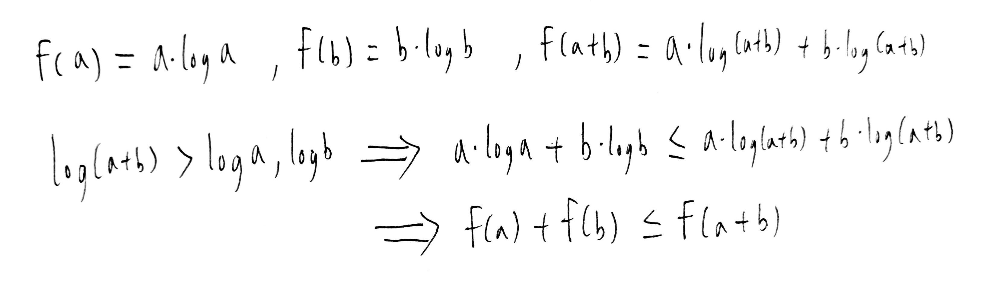

# Homework 1
#### B10902033 林祐辰
 
Problem 5: 
(a) Complexity: 
1.Prove 2.Prove 3.Prove 4.Prove 5.Prove 6.(a)Prove 6.(b)Prove(refer to formula in text book 3-20 and 3-21) 
 
 
(b) Fill-in: 4 < 1 < 2 < 5 < 3 < 6 
 
(c) Recursion: 1. O(n ^ 1.5) 2. O(n) 
 
 
Problem 6: 
(a) 
1.False 2.True 3.False 4.True 5.True 
(b) 
Algorithm: 
First do a merge sort on the n strings and in the merge functions, compair two strings character by character, when compairing put two characters in the gene comparator, if the results is two strings are the same then put them in a group, else continue doing the merge sort. 
Correctness: 
First two strings in the same group must be identical because the algorithm only put them in the same group if they are the same. Second the algorithm will correctly seperate different strings since merge sort will traverse through every strings at least one time. 
Time complexity: 
Because the time complexity of merge sort is O(n * log n) and in the merge function comparing two strings need O(k), so the total time complexity will be O(n * k * log n). 
(c) 
Algorithm:
The concept of finding similar pairs in algorithm is that we can cut the strings in half and if we find the left side is the same than we do the algorithm again at the right, or else if the right side is the same than we do the algorithm again at the left. 
So to accomplish this we can use the algorithm in question (b), first throw all n strings in (b) without cutting than we can take out one string in each group, and cut the strings in half throw the left side to (b) which will form same left group and recursively do the algorithm at the right side in same left group, similar for the right side.And at last when the string has two characters with same right or same left the one with different character left is the similar pair, so mutiply the number of group members in the same strings group which are similar and add them up, and we will get the total number of similar pairs. 
(d) 
Correctness: 
The algorithm is correct cause while doing the divide and conquer we will only dismiss the strings that have different left side and different right side which won't be similar strings, and there won't be strings that are identical since we first seperate them into deifferent group, so the remaining ones will be similar pairs. 
(e) 
 
(f) 
Time complexity: 
Because by divide and conquer we call the algorithm in (b) O(log k) times, so the time complexity would be O(n * k * log n * log k). 
(g) 
    
Reference: 
Problem 1: https://www.geeksforgeeks.org/divide-and-conquer/ 
Problem 2: B10902034 李沛宸 
Problem 3: B10902034 李沛宸, https://www.geeksforgeeks.org/counting-inversions/ 
Problem 4: B10902034 李沛宸 
Problem 5: B10902034 李沛宸, textbook 
Problem 6: B10902034 李沛宸 