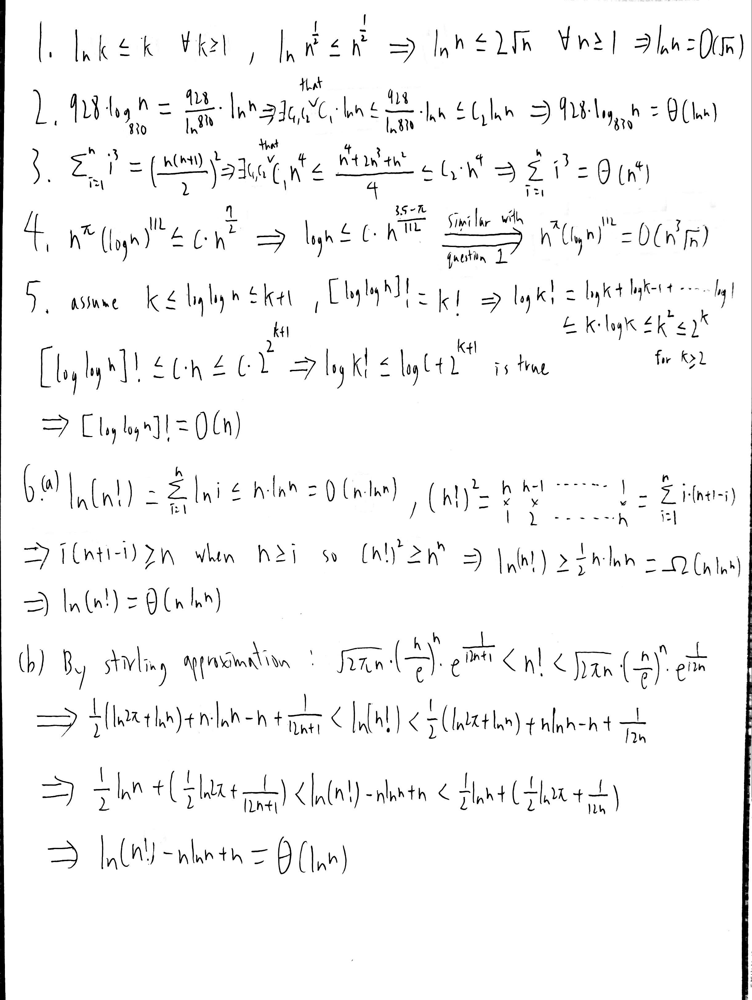
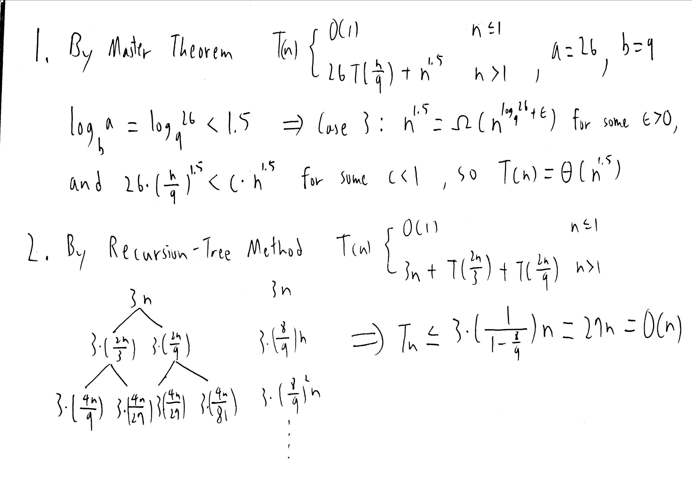

# Homework 1
#### B10902033 林祐辰
 
Problem 5: 
(a) Complexity: 
1. Prove 2. Prove 3. Prove 4. Prove 5. Prove 6.(a) Prove 6.(b) Prove 
 
 
(b) Fill-in: 4 < 1 < 2 < 5 < 3 < 6 
 
(c) Recursion: 1. O(n ^ 1.5) 2. O(n) 
 
 
Problem 6: 